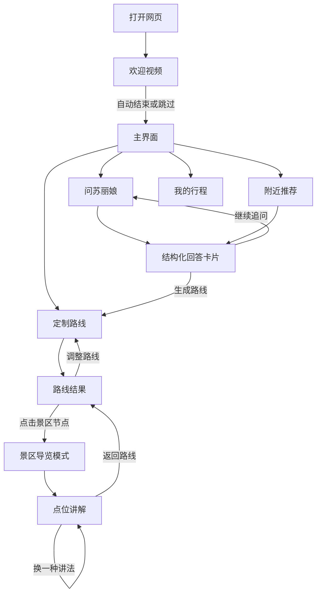
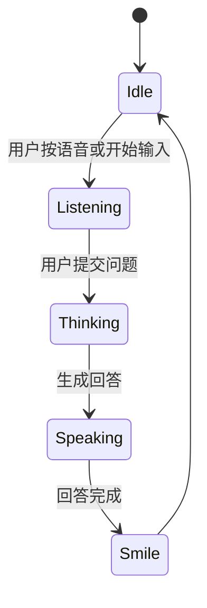

# 苏丽娘 AI 数字导游 Demo 开发 PRD v0.1

## 1. 产品定位

苏丽娘 AI 数字导游 Demo 是一个面向比赛展示的手机端优先网页原型。它不是普通景区讲解页，而是一个“游客随身苏州 AI 导游”：用户可以随时问苏丽娘关于苏州旅行的问题，也可以让她定制路线，并从路线中的景区节点进入具体导览。

桌面网页作为演示容器存在：电脑端可以切换手机预览和桌面演示模式，方便开发调试、现场展示和录屏。

## 2. 核心目标

1. 让评委一眼看到“苏丽娘是会动、会说、会回应的数字人导游”。
2. 让用户在手机端能自然完成：问问题、定路线、进景区、听讲解。
3. 用状态短视频体现情感交互：待机、欢迎、倾听、思考、说话、讲解、吟诵、微笑。
4. 用路线节点把“城市导游”和“景区讲解”连起来，避免 Demo 看起来只会讲拙政园。
5. 保留多语言、本地推荐、酒店/广告转化等后续扩展空间，但 v0.1 先以中文主流程为核心。

## 3. 用户旅程



## 4. 信息架构

```text
苏丽娘 AI 数字导游
├─ 欢迎页
├─ 主界面
│  ├─ 问苏丽娘
│  ├─ 定制路线
│  ├─ 附近推荐
│  └─ 我的行程
├─ 路线结果
│  ├─ 景区节点
│  ├─ 美食节点
│  └─ 交通/时间建议
├─ 景区导览
│  ├─ 拙政园精讲样板
│  │  ├─ 远香堂
│  │  ├─ 与谁同坐轩
│  │  ├─ 小飞虹
│  │  ├─ 香洲
│  │  └─ 待霜亭
│  └─ 虎丘轻量样板/可扩展展示
└─ 桌面演示控制台
```

## 5. 页面与用户故事

### US-01 桌面演示容器

**目标**

作为参赛展示者，我希望在电脑网页上同时看到手机端真实效果和演示控制区，以便现场展示、录屏和调试。

**布局**

```text
┌────────────────────────────────────────────────────────────────────┐
│ 苏丽娘 AI 数字导游 Demo                         [Mobile] [Desktop] │
├────────────────────────────────────────────────────────────────────┤
│                                                                    │
│  ┌──────────────────────────────┐   ┌───────────────────────────┐  │
│  │        手机预览 9:16          │   │       演示控制台           │  │
│  │ ┌──────────────────────────┐ │   │ 当前状态：idle             │  │
│  │ │                          │ │   │ 语言：中文 / EN / IT       │  │
│  │ │   手机内真实体验          │ │   │                           │  │
│  │ │                          │ │   │ 预设演示：                │  │
│  │ │                          │ │   │ [问美食] [定制路线]       │  │
│  │ │                          │ │   │ [进拙政园] [多语言样例]   │  │
│  │ └──────────────────────────┘ │   │                           │  │
│  └──────────────────────────────┘   │ 状态视频测试：            │  │
│                                     │ [idle] [listen] [think]   │  │
│                                     │ [speak] [guide] [smile]   │  │
│                                     └───────────────────────────┘  │
└────────────────────────────────────────────────────────────────────┘
```

**规则**

- `Mobile` 模式显示固定 9:16 手机框。
- `Desktop` 模式可展示更宽的信息面板，但核心体验仍来自手机框。
- 演示控制台用于触发预设问题、切换状态视频、切换语言，不直接暴露给普通游客。

**验收标准**

- 桌面端能清楚看到手机 9:16 预览。
- 右侧控制台能手动触发至少 6 个数字人状态。
- 切换 Mobile/Desktop 不影响手机框内部状态。

### US-02 欢迎页

**目标**

作为首次进入的游客，我希望先看到苏丽娘完整的欢迎视频，而不是被文字和按钮打断，从而快速建立“数字人导游”的第一印象。

**设计决策**

欢迎页不再承载功能分流。欢迎页只做开场动画和极简操作。欢迎语由视频音频读出来，不在下方放大段文字。

**布局**

```text
┌──────────────────────────┐
│                    [跳过]│
│                          │
│                          │
│                          │
│       9:16 欢迎视频       │
│       welcome_once        │
│                          │
│                          │
│                          │
│                          │
│                          │
├──────────────────────────┤
│        [进入苏州导游]      │
└──────────────────────────┘
```

**文案/语音**

建议欢迎语：

> 我是苏丽娘，你的苏州 AI 数字导游。问路线、找美食、听讲解，都可以交给我。今天，我们从哪里开始？

**规则**

- 欢迎视频全屏或接近全屏展示，保持 9:16。
- 右上角只保留 `跳过`。
- 视频播放结束后显示或强调底部主按钮 `进入苏州导游`。
- 不在欢迎页放 `定制路线`、`直接问她` 等多个入口，避免逻辑混乱。

**验收标准**

- 欢迎视频不被大量文字挤压。
- 用户可跳过欢迎。
- 视频结束或点击按钮后进入主界面。

### US-03 主界面

**目标**

作为游客，我希望进入后立刻看到苏丽娘在等待我提问，同时能清楚找到问答、路线、附近推荐和行程入口。

**设计决策**

主界面要让苏丽娘占主导，而不是变成小头像。功能按钮以浮层方式覆盖在视频上或贴近底部，保留数字人沉浸感。

**布局**

```text
┌──────────────────────────┐
│ 苏丽娘              [语言]│
│                          │
│                          │
│       苏丽娘待机视频       │
│        idle_loop          │
│                          │
│                          │
│                          │
│   ┌──────────────────┐   │
│   │ 今天想问我什么？  │   │
│   │ 例如：苏州吃什么  │   │
│   └──────────────────┘   │
│                          │
│ [问苏丽娘] [定制路线]     │
│ [附近推荐] [我的行程]     │
│                          │
│  输入问题...        [🎙]  │
└──────────────────────────┘
```

**规则**

- 主界面默认播放 `idle_loop`。
- 数字人画面占主要视觉区域。
- 四个功能入口浮在下方，不遮挡脸部和关键服饰。
- 输入框是全局入口，用户可以直接提问，也可以点击功能入口。

**验收标准**

- 用户无需理解复杂菜单即可开始问问题。
- 数字人存在感强，不被压缩成小窗。
- 主界面能进入问答、路线、附近推荐、我的行程。

### US-04 问苏丽娘

**目标**

作为游客，我希望能像问真人导游一样问苏丽娘问题，并得到可读、可操作的回答。

**布局**

```text
┌──────────────────────────┐
│ 问苏丽娘            [返回]│
├──────────────────────────┤
│ ┌──────────────┐          │
│ │ 苏丽娘小窗    │ 当前状态 │
│ └──────────────┘          │
│                          │
│ 用户：苏州有什么好吃的？  │
│                          │
│ 苏丽娘：                 │
│ ┌──────────────────────┐ │
│ │ 推荐你试试这些苏州味道 │ │
│ │ 1. 苏式汤面           │ │
│ │ 2. 生煎               │ │
│ │ 3. 桂花糖粥           │ │
│ │ 4. 松鼠桂鱼           │ │
│ └──────────────────────┘ │
│ [加入路线] [附近看看]     │
├──────────────────────────┤
│ 输入问题...        [🎙]   │
└──────────────────────────┘
```

**状态流**



**规则**

- 用户输入时播放 `listening_loop`。
- 大模型生成时播放 `thinking_loop`。
- 朗读回答时播放 `speaking_loop`。
- 回答结束播放 `smile_once`，然后回到 `idle_loop`。
- 回答尽量结构化为卡片，不只是一段长文字。

**验收标准**

- 用户能用文字完成一次问答。
- 回答期间数字人状态变化明确。
- 回答可展示为卡片，并提供下一步操作。

### US-05 定制路线

**目标**

作为游客，我希望告诉苏丽娘我的时间、偏好和同行情况，她能给我生成一条可执行路线，并允许我继续微调。

**布局：输入态**

```text
┌──────────────────────────┐
│ 定制路线            [返回]│
├──────────────────────────┤
│ ┌──────────────┐          │
│ │ 苏丽娘小窗    │ thinking │
│ └──────────────┘          │
│                          │
│ 你今天怎么玩？            │
│ [半天] [一天] [两天]      │
│ [园林] [美食] [亲子]      │
│ [轻松少走路] [历史文化]   │
│                          │
│ 额外要求：                │
│ ┌──────────────────────┐ │
│ │ 比如带老人，想轻松一点 │ │
│ └──────────────────────┘ │
│                          │
│ [生成路线]               │
└──────────────────────────┘
```

**布局：结果态**

```text
┌──────────────────────────┐
│ 我的苏州一日路线    [调整]│
├──────────────────────────┤
│ 路线 A：园林与古城轻松线  │
│                          │
│ ┌──────────────────────┐ │
│ │ 09:30 拙政园          │ │
│ │ 苏州园林代表，适合精讲 │ │
│ │ [开始导览] [附近美食]  │ │
│ └──────────────────────┘ │
│ ┌──────────────────────┐ │
│ │ 12:00 平江路          │ │
│ │ 小吃、咖啡、老街散步   │ │
│ │ [查看推荐]            │ │
│ └──────────────────────┘ │
│ ┌──────────────────────┐ │
│ │ 15:00 虎丘            │ │
│ │ 历史遗迹，可扩展导览   │ │
│ │ [查看介绍]            │ │
│ └──────────────────────┘ │
└──────────────────────────┘
```

**规则**

- 路线结果必须由节点卡片组成。
- 景区节点可进入景区导览。
- 美食/街区节点可进入附近推荐或展示轻量说明。
- 用户可继续通过对话微调路线，例如“少走路一点”“加一个适合拍照的地方”。

**验收标准**

- 用户能生成至少一条路线。
- 路线中至少包含一个可点击景区节点。
- 点击拙政园节点能进入拙政园导览样板。

### US-06 从路线进入景区导览

**目标**

作为游客，我希望从定制路线中的景区节点自然进入该景区的导览，而不是感觉导览功能是孤立的。

**规则**

- 路线中的景区节点展示 `开始导览`。
- Demo v0.1 内置拙政园精讲样板。
- 虎丘等景区可作为轻量卡片展示：有介绍、有“未来可扩展导览”提示，不假装已完整内置。

**验收标准**

- 路线结果页点击 `拙政园 - 开始导览` 后进入景区导览模式。
- 用户能从景区导览返回路线结果页。

### US-07 景区导览

**目标**

作为到达景区的游客，我希望点选当前景区内的点位，由苏丽娘讲解历史和故事。

**布局**

```text
┌──────────────────────────┐
│ 拙政园导览          [返回]│
├──────────────────────────┤
│ ┌──────────────┐          │
│ │ 苏丽娘小窗    │ guide    │
│ └──────────────┘          │
│                          │
│ 当前景区：拙政园          │
│ ┌──────────────────────┐ │
│ │      简化地图/点位图   │ │
│ │  远香堂  小飞虹        │ │
│ │  与谁同坐轩  香洲      │ │
│ └──────────────────────┘ │
│                          │
│ 点位列表：                │
│ [远香堂] [与谁同坐轩]     │
│ [小飞虹] [香洲] [待霜亭]  │
└──────────────────────────┘
```

**点位讲解**

```text
┌──────────────────────────┐
│ 与谁同坐轩          [返回]│
├──────────────────────────┤
│ ┌──────────────┐          │
│ │ 苏丽娘小窗    │ speaking │
│ └──────────────┘          │
│                          │
│ 这座扇形小轩，名字出自    │
│ 苏东坡的词：“与谁同坐？  │
│ 明月、清风、我。”        │
│                          │
│ [给孩子讲] [诗意一点]     │
│ [英文讲解] [附近下一站]   │
│                          │
│ [播放讲解] [加入我的行程] │
└──────────────────────────┘
```

**规则**

- 进入景点讲解播放 `guide_once`，朗读时播放 `speaking_loop`。
- 诗词/昆曲相关内容可播放 `recital_once`。
- 讲解结束播放 `smile_once`。
- v0.1 中文优先，保留英文/意大利语样例按钮。

**验收标准**

- 用户能从拙政园点位列表进入至少一个点位讲解。
- 点位讲解包含文字、语音/朗读状态和数字人动作。
- 用户可返回景区列表或路线页。

## 6. 数字人状态视频映射

| 用户/系统状态 | 视频 |
|---|---|
| 默认待机 | `idle_loop.mp4` |
| 欢迎开场 | `welcome_once.mp4` |
| 用户输入/语音 | `listening_loop.mp4` |
| AI 生成中 | `thinking_loop.mp4` |
| 朗读回答 | `speaking_loop.mp4` |
| 景区/点位讲解启动 | `guide_once.mp4` |
| 诗词/昆曲内容 | `recital_once.mp4` |
| 完成反馈 | `smile_once.mp4` |

## 7. v0.1 范围

### 必做

- 桌面演示容器。
- 手机欢迎视频页。
- 手机主界面。
- 问答流程。
- 路线定制流程。
- 路线结果节点卡片。
- 从拙政园节点进入导览。
- 至少一个点位完整讲解。
- 数字人状态视频切换。

### 可做

- 五个拙政园点位都可点。
- 英文/意大利语讲解样例。
- 附近美食推荐卡片。
- 演示控制台预设问题。

### 暂不做

- 真正地图定位。
- 实时酒店/餐厅广告系统。
- 商业支付或预约。
- 完整多景区知识库。
- 真 3D 模型驱动。

## 8. 待确认事项

1. 欢迎页底部按钮是否只保留 `进入苏州导游`，还是视频结束后自动进入主界面。
2. 主界面四个入口是否确定为：问苏丽娘、定制路线、附近推荐、我的行程。
3. 拙政园样板首个重点讲解点位选哪个：与谁同坐轩还是远香堂。
4. v0.1 是否需要真实语音输入，还是先用文字输入 + 预设语音按钮模拟。
5. TTS 朗读是否必须接实时接口，还是先用浏览器朗读或预制音频。
